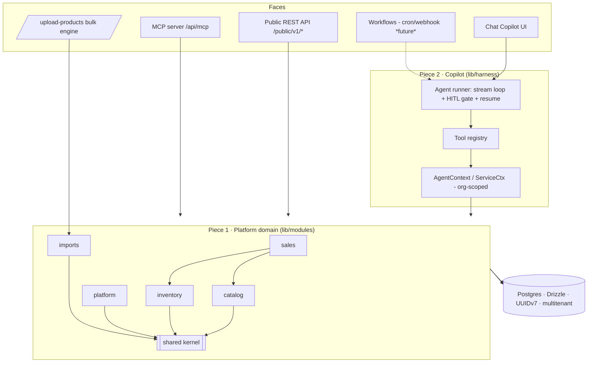

# Distru Agentic Harness - Tech Spec

> Author: Chase Pierce · Status: Reference implementation (runnable) + spec
> Scope: The agentic harness for Distru, with "upload a product-catalog CSV" as the first use case.

This document is backed by a **working implementation** in this repo, not just prose. Where the spec says "the harness does X," there is code that does X, and a smoke test that exercises it. Read this alongside `README.md` (how to run) and the `lib/` tree.

---

## 1. Context & goals

Distru is a seed-to-sale ERP for licensed cannabis operators. We are building an **agentic harness** that will eventually power two products:

1. **Automated workflows** - cron/webhook-triggered automations across Distru + connected tools (QuickBooks, Metrc, Drive…).
2. **A Cowork-style chat copilot** - users ask questions and perform one-off actions; the copilot uses the Distru MCP plus the customer's other MCP servers.

The exercise's first use case is: **"a customer uploads a CSV of their product catalog and it just works,"** where the file is in an unpredictable, per-customer format and can be 100 to 10,000+ rows.

Rather than build a one-off CSV importer, this implementation builds the **harness** the importer rides on, so the same substrate powers chat today and workflows tomorrow. To make the design decisions real (and testable), the repo also implements the slice of Distru the harness acts on - **we are Distru** here: a multitenant catalog/inventory core, a Distru-API-faithful public API, an MCP server, and signed webhooks.

**Design thesis: a modular platform, with a Copilot on top.** This is deliberately **two pieces**. Piece 1 is the platform: an org-scoped domain of **bounded-context modules** (`lib/modules/*`) that is the single source of truth and has *no dependency on the AI*. Piece 2 is the agentic harness (`lib/harness/*`), layered over it. Every face - chat, REST, MCP, bulk - is a thin adapter over the same modules, so adding a capability = one module function + thin wrappers. The module boundaries (public barrels; a downward-only, acyclic dependency graph; domain-never-imports-Copilot) are **enforced by ESLint**, so the architecture is a modular monolith that stays extractable into services as scope grows.

---

## 2. Architecture



**Stack:** Next.js 16 (App Router) + React 19, TypeScript, Tailwind v4, deployable to Vercel. Postgres via Drizzle (`postgres.js` driver - portable local↔Neon). Auth + multitenancy via **better-auth** + organization plugin. Agent via a **provider-agnostic model seam** (§3.7): `MODEL_PROVIDER` selects Anthropic (`claude-opus-5`, adaptive thinking, streaming) or OpenAI (`gpt-4.1`), and adding a vendor is one adapter + one env var. Chat UI uses **lucide-react** + **streamdown** (streaming markdown). Everything is **UUIDv7** end to end (auth rows and domain rows share one keyspace).

Why these choices:

- **One language, one deploy target.** Next on Vercel means the agent loop, the REST API, the MCP server, and the UI live in one codebase with one auth story.
- **Modules over the DB, not over HTTP.** The chat tools call module functions directly (no internal HTTP hop), so the agent is fast and transactional; the REST/MCP faces call the *same* functions. There is exactly one place that knows how to create a product.
- **Manual streaming agent loop** (not the SDK tool-runner) because human-in-the-loop needs to *pause a turn mid-stream, persist, and resume across a stateless serverless invocation* - control the tool-runner doesn't expose.
- **Provider-agnostic by design** (§3.7). The runner, tools, HITL, and conversation store never name a vendor; a `ModelProvider` adapter is the only model-specific code, so Anthropic↔OpenAI is an env flip, not a rewrite.

### 2.1 Data model (Drizzle + Postgres; every domain row org-scoped, UUIDv7)

Full schema in `db/schema/` (~70 tables, one file per bounded context). Grouped:

- **Auth / tenancy** (better-auth): `user`, `session`, `account`, `verification`, `organization`, `member`, `invitation`.
- **Catalog:** `products` (SKU unique per org, plus UPC, MSRP, THC/CBD, brand/strain/subcategory/product-group FKs, flags), `product_images`, `categories`, `product_subcategories`, `product_groups`, `official_product_categories`, `strains`, `companies` (VENDOR / BRAND / CUSTOMER), `company_groups`, `contacts`, `locations`, `unit_types` (global reference set), `taxes`, `tags`, `price_tiers`, `charge_presets`, `custom_fields`, `menus`.
- **Inventory:** `inventory_ledger` - append-only movements, on-hand = `SUM(quantity_delta)`; `batches`, `packages`, `bins`.
- **Sales:** `orders` + `order_items` (SKU/name snapshotted per line) + `order_charges` (fee/discount/shipping/tax breakdown), `invoices` (financial snapshot + void flag), `payments`, `payment_methods`, `payment_terms`, `credits`, `returns` + `return_items` - confirming an order posts negative `inventory_ledger` movements.
- **Purchasing:** `purchase_orders` + `purchase_order_items`.
- **Manufacturing:** `assemblies` + `assembly_inputs` / `assembly_outputs`, `costs`, `cost_types`.
- **Compliance:** `licenses`, `license_types`, `test_results` (Metrc/BioTrack-shaped COAs).
- **Logistics:** `drivers`, `vehicles`.
- **Cultivation:** `plant_batches` → `plants` (with a `plant_phase` lifecycle: IMMATURE→VEGETATIVE→FLOWERING→HARVESTED/DESTROYED) → `harvests` (wet/dry weights) - the grow side of seed-to-sale.
- **Imports:** `import_files`, `import_jobs`, `import_rows` (the 10k rows live here, never in the model).
- **Chat / harness:** `conversations`, `messages` (raw content blocks - the canonical IR), `tool_calls` (input / output / status / decision).
- **Automations:** `workflows`, `workflow_runs` (headless runs with per-run transcript + status).
- **Platform:** `api_tokens` (SHA-256 hashed), `webhook_endpoints`, `webhook_deliveries`, `tasks`, `file_attachments`, `audit_log` (every mutation, from every face).

---

## 3. The agentic harness (the centerpiece)

### 3.1 Tool contract (`lib/harness/tool.ts`)

Every capability is a self-describing tool:

```ts
type HarnessTool<I> = {
  name: string;
  description: string;
  inputSchema: z.ZodType<I>;          // → JSON Schema for Claude via z.toJSONSchema
  gate: "none" | "confirmation" | "question";
  buildPreview?(input, ctx): HarnessToolPreview;   // the Approve/Reject or question card
  execute(input, ctx, extra?): Promise<ToolResult>;
};
```

Tools are registered in a registry (`lib/harness/registry.ts`); `toAnthropicTools()` derives the Claude tool schemas from the Zod schemas. **Adding a capability is adding a tool** - nothing else in the loop changes.

### 3.2 Tenant-scoped context

`AgentContext` carries `{ service: {orgId, actor, actorType}, userId, conversationId, emit }`. Every tool runs against `service`, so **multitenancy is enforced at the tool boundary** - a tool physically cannot read another org's rows. The same `ServiceCtx` shape is built by the REST API (`actorType: "api"`), MCP (`"api"`), imports (`"import"`), and a future workflow (`"system"`), so the audit trail attributes every mutation to whoever caused it.

### 3.3 The runner (`lib/harness/runner.ts`)

A manual streaming loop over the active provider's `streamTurn` (§3.7), not a vendor SDK call directly:

1. Load conversation history from Postgres → `MessageParam[]`.
2. Stream an assistant turn; emit NDJSON events (`token`, `thinking`, `tool_start`, `tool_input`, `tool_result`, `interrupt`, `error`, `done`) to the client.
3. On `tool_use`: execute **non-gated** tools immediately; for **gated** tools, build a preview, persist the call as `pending`, and emit an `interrupt` that terminates the turn.
4. Feed non-gated results back and loop until `end_turn` (capped at 16 steps).

Persistence is first-class: messages are stored as raw Anthropic content blocks (so a turn replays verbatim, including thinking blocks bound to the model), and every tool call is a `tool_calls` row with input/output/status/decision - this is both the chat history and the **audit trail**.

### 3.4 Human-in-the-loop (concrete, serverless-safe)

Mutating tools (`gate: "confirmation"`) and `ask_user` (`gate: "question"`) never auto-run. The mechanism:

- **Trigger:** the runner sees a gated `tool_use`, calls `buildPreview(input, ctx)` (e.g. a create-product diff, or a validation summary), writes a `pending` `tool_calls` row, emits `interrupt`, and **closes the stream**. No partial `tool_result` is sent, so the assistant turn is left open exactly as Anthropic requires.
- **Who can act:** any member of the conversation's org; the decision + actor are recorded on the `tool_calls` row.
- **Resume:** the client `POST`s decisions to `/api/conversations/[id]/resume`. The server rebuilds the message history, and for **every** `tool_use` in the last assistant turn produces a `tool_result` - reusing stored output for already-executed tools, executing approved mutations now, writing "user declined" for rejects, and passing the answer through for `ask_user`. It appends one combined `tool_result` user message and re-enters the loop. Fully resumable across stateless invocations; nothing lives in server memory between turns.

`ask_user` is a distinct gate (not a mutation) so the model can get a structured decision mid-task - "Category 'Edibles' doesn't exist, create it?" - with typed options, without a plain-text guess.

```mermaid
sequenceDiagram
    participant U as User
    participant UI as Chat dock
    participant R as Runner (/messages)
    participant DB as Postgres
    participant M as Claude
    U->>UI: message
    UI->>R: POST /messages (NDJSON stream)
    R->>M: stream turn (tools)
    M-->>R: tool_use (mutating)
    R->>DB: persist assistant turn + pending tool_call (with preview)
    R-->>UI: interrupt -> Approve / Reject card
    Note over R,UI: turn paused; no server-side state held
    U->>UI: Approve
    UI->>R: POST /resume {decision}
    R->>DB: rebuild history + load pending calls
    R->>DB: execute approved tool (write) + audit
    R->>M: continue with tool_result(s)
    M-->>R: final answer
    R-->>UI: tokens + done (page refreshes)
```

Verified in this repo: mutation → interrupt with preview → **approve** writes the row (checked in Postgres); **reject** returns "user declined" and the model adapts.

### 3.5 Trigger-agnostic by construction

`runConversationTurn` is just "chat trigger → build AgentContext → run loop." A future **workflow** trigger builds the same context with a service actor and runs the same tools. The harness has no idea whether a human or a cron fired it. That is the whole point of the design.

### 3.6 Tools beyond our own (external MCP servers)

The brief's copilot uses the Distru MCP *plus the customer's own connected MCP servers* (QuickBooks, Sage, Metrc, Google Drive/Sheets, Calendar). The registry is built for exactly that: a tool is just `{ name, description, inputSchema, gate, execute }`,c so tools sourced from an external MCP server register alongside the built-ins and inherit the **same gate/preview/audit** wrapper - a QuickBooks `create_invoice` would show the same Approve card as our `create_product`, and land in the same audit log. What's implemented here is the internal registry and our own MCP *server* (so others can drive Distru); the deferred piece is the MCP *client* that discovers a customer's connected servers and registers their tools. This is also what powers cross-tool **workflows** - e.g. the brief's "lab COA email → attach the PDF in Drive → mark the Distru inventory ready for sale" is just that same loop with an email trigger and tools from three MCP servers.

### 3.7 Provider-agnostic model seam (`lib/harness/providers/`)

The runner never imports a vendor SDK. A `ModelProvider` interface - `{ id, model, isConfigured(), streamTurn(req, emit) }` - is the *only* model-specific code, and `MODEL_PROVIDER` (default `anthropic`; also `openai`) selects the active one. Two adapters ship: Anthropic (`claude-opus-5`, native streaming + thinking) and OpenAI (`gpt-4.1`, over the Chat Completions API, `OPENAI_BASE_URL` overridable for Azure/Open-compatible gateways). Adding a vendor is one file + one registry entry.

The trick that keeps this clean: the harness standardizes on **Anthropic's content-block message shape as its canonical IR** (`text` / `tool_use` / `tool_result` / `thinking`) - it's a superset, and it's what we already persist. A provider that speaks a different wire format translates at *its* edge (OpenAI `tool_calls` ↔ our `tool_use` blocks) and the rest of the system - loop, HITL gate, tool registry, conversation store, audit - never sees the difference. So "swap Anthropic for OpenAI" is genuinely an env flip, and the integrations a customer wires up (tools, gates, workflows) work identically on either.

---

## 4. The product-import capability (flagship)

Built as a **generic import framework** (so it scales to other CSV types), not a product-only script.

### 4.1 The `ImportTarget` seam (`lib/imports/target.ts`)

```ts
type ImportTarget<Prep, Value> = {
  key; label; description;
  fields: CanonicalField[];            // canonical schema + aliases + enums + fk kinds
  prepare(ctx): Promise<Prep>;         // load reference caches ONCE per run
  validateRow(mapped, prep): ValidateResult<Value>;   // pure, per-row
  commitRows(rows, ctx, prep): Promise<{productId?}[]>;
};
```

Seven targets are registered today and all ride the same pipeline: **products** (upsert catalog), **customers** and **vendors/distributors** (CRM companies), **price-list** (update prices by SKU), **inventory-count** (set on-hand by SKU), **locations** (warehouses), and **orders** (line items grouped into draft sales orders). Adding one is a single file - mapping, detection, validation, partial commit, and the error CSV all work for it with **zero pipeline changes**. That is the answer to "how does this scale to other CSVs?" - and it's why the agent can say *"I think this is a distributor list / price sheet / inventory count / sales-order export - what do you want to do with it?"* about a file it's never seen.

### 4.2 The pipeline (`lib/imports/pipeline.ts`)

The agent **orchestrates**; deterministic code does the heavy lifting. The model never sees more than headers + ~20 sample rows. The upload is **target-agnostic** - the agent detects what the file is and asks the user what to do, rather than assuming "products."

1. **Upload** (`POST /api/imports`) - parse CSV/XLSX (`papaparse` / `xlsx`), persist the file, headers, a sample, and **every row** to `import_rows` (rows live in Postgres, never in the LLM context). Returns a `job_id`.
1b. **Detect + confirm intent** (`detect_import_target` → `ask_user` → `set_import_target`) - `scoreTargets(headers)` ranks every registered target by how well its canonical fields match the columns (e.g. a customer list scores 100% on `customers`, 15% on `products`). The agent then asks *"This looks like a customer list - import as customers, as products, or something else?"* with concrete options, and retargets the job to whatever the user chooses. This is the "throw any CSV in and have a real conversation about it" flow, and it's what makes the framework's multi-target design visible to the user.
2. **Map** (`propose_column_mapping`) - a deterministic alias/fuzzy matcher produces a baseline; Claude refines it for the long tail (weird headers, sample-value inference), and falls back to the baseline if the model is unavailable. Result is an editable `ColumnMapping` stored on the job. `set_column_mapping` applies user corrections.
3. **Validate** (`validate_import`) - chunked (500 rows). Each row → `validateRow`: required fields, enum/number coercion (`"$3.25"`→`3.25`, `"grams"`→Gram), unknown-unit rejection, and **new-reference detection** (categories/vendors that would be created). Returns an **aggregate** summary (valid/warn/error counts, top error reasons, new references) - never raw rows.
4. **Confirm + commit** (`commit_import`, gated) - upserts valid + warning rows **by SKU** in chunks; **partial success** (error rows are skipped, not fatal). Re-derives the validated value from the persisted mapped row, so nothing extra is stored.
5. **Error report** (`get_error_report`) - a **row-mapped error CSV** (`_row`, original columns, `_errors`) downloadable in chat, mirroring Distru's real bulk-upload behavior.

The same commit engine is exposed directly as `POST /upload-products` (the internal endpoint the exercise references) for exact-template files and API callers.

### 4.3 Scale (100 → 10,000+ rows)

Rows are persisted and processed in chunks with progress; validate/commit are O(rows) with O(1) LLM calls (mapping only). In this repo, chunked processing runs in-process within Vercel's `maxDuration`. **For >10k rows and for the future "scan this Google Sheet nightly" workflow, the documented production path is a queue** (QStash/Inngest) that drives the exact same `validateImport`/`commitImport` chunk functions - no rewrite, because the pipeline is already chunked and job-backed.

---

## 5. Faithful Distru clone (why it's credible)

Modeled directly on Distru's real surface (`apidocs.distru.dev`, `mcp.distru.com`, the bulk-upload help center):

- **Product schema:** inventory tracking method (`PACKAGE|PRODUCT|BATCH`), name, unique SKU, UPC, category + subcategory, vendor and brand (CRM companies), strain, product group, unit type (fixed singular set), unit price, MSRP, net qty / serving fields, THC/CBD potency, `is_inventory_item` / `is_sample` / `taxable` flags, an ordered **images** array (`{ id, url, position, is_primary }`), and custom fields.
- **Resource surface:** the public REST API + MCP span the full Distru breadth - **136 documented routes** (Distru itself documents 128): catalog (products/images/product-categories/subcategories/groups/strains/companies/contacts/locations/unit-types/taxes/tags/menus/price-tiers), sales (orders/invoices/payments/credits/returns/charge-presets/adjustments), purchasing (purchases), manufacturing (assemblies/costs), compliance (licenses/test-results), logistics (drivers/vehicles), platform (custom-fields/file-attachments/tasks/users), a **Reports** API (18 endpoints), **Metrc** endpoints, **PDF** document routes, an **inventory** snapshot, and nested actions (record payment, attach image, void, add-costs…). Real behavior where the domain supports it; **API-accurate mock providers** for the external-integration surface (Metrc, QuickBooks, LeafLink - behind a real provider seam, §5) rather than fabricated data - the full audit is in **`DISTRU-PARITY.md`**. Every one of these resources also has an operator screen now (§7); a REST route with no UI is the exception, not the rule.
- **Public API conventions:** `Authorization: Bearer` tokens (SHA-256 hashed at rest); UUID ids; **numbers serialized as strings** (`"25.000000"`, 6 dp); microsecond ISO-8601 `…Z` datetimes; uppercase enums; nulls always present; **`page[number]` pagination echoing a followable `next_page` URL** (as Distru documents; we additionally accept an opaque `page[after]` cursor); comma-delimited inclusive datetime range filters; `{ errors: [{ message, pointer, section }] }`; **sparse upsert** (omit id→create, include→update, omit field→leave); **HMAC-signed webhooks** (`x-distru-signature: sha256=…`) with `CREATE/UPDATE/DELETE`.
- **Self-documenting OpenAPI:** the OpenAPI 3.1 spec is **generated from the code** (route handlers + Zod schemas via `z.toJSONSchema`), served in-app under `/docs`, and a **prebuild drift guard** (`scripts/check-openapi.ts`, wired as `prebuild`) fails the build if any `/public/v1/**` route is missing from the spec, or lacks a documented method or 2xx schema - unless the route is on an explicit `OPENAPI_IGNORE` opt-out list (e.g. `/health`). Documentation can't silently rot: it's part of the same green build.
- **MCP server** (`/api/mcp`, Streamable-HTTP JSON-RPC). Its `tools/list` is **derived from the harness registry** (`create_order` → `distru-create-order`), so the external tool surface tracks the copilot's own - product/inventory/catalog/order reads and writes, plus analytics - and an *external* agent can drive Distru, the mirror image of our own copilot.

All of these are implemented and were exercised with `curl` during development (see `README.md` → Verify), and `npm run check:openapi` currently reports **all 136 routes documented**.

- **External integrations as a provider seam** (`lib/integrations/`, mirroring the model seam §3.7). The systems Distru syncs with — **Metrc** (track-and-trace), **QuickBooks** (accounting), **LeafLink** (marketplace), **BioTrack** — sit behind interfaces (`MetrcProvider`, `AccountingProvider`, …) chosen by env (`METRC_PROVIDER`, etc.; default `mock`, `none` = unconnected). The shipped **mock** adapters return **API-accurate** data (shaped to Distru's own Metrc schemas) that is **coherent** — a Metrc package is seeded from a real product's on-hand, a transfer from a real order, a company's `qb_vendor_id` is deterministic in its id — never random. The `/metrc/*` endpoints and the `leaflink_*`/`qb_*`/`metrc_*`/`biotrack_id` fields are populated by these providers; swapping in a live adapter is one file, no route or serializer change.
- **Field-level parity, audited against the authoritative spec.** We diffed every core resource against Distru's real OpenAPI (`apidocs.distru.dev/openapi.json` — 128 paths, 297 schemas) and aligned the wire shapes exactly: `inserted_datetime` (not `created_datetime`), a company's `relationship_type`, an order's `company` + `items[].product`/`price`, product `total_thc`/`total_cbd`/`is_active`/`unit_net_weight`, invoice `paid_amount`/`remaining_amount`/`voided_datetime` with embedded `items`/`charges`, contact `first_name`/`last_name`. The full before/after and the deliberately-deferred deltas (Reports/Metrc/PDF subsystems, integration IDs) are in **`DISTRU-PARITY.md`**.

In production the harness's product tools would call Distru's real MCP/API; here they call the service layer directly because this repo *is* Distru. The tool contract is identical either way, so swapping the backing call is a per-tool change, not a harness change.

---

## 6. Edge cases & product decisions (with rationale)

| Decision | Choice | Why |
|---|---|---|
| Arbitrary CSV columns | LLM mapping **seeded by** a deterministic matcher, with fallback | Deterministic handles the 80% cheaply and works offline; the LLM handles the long tail; fallback means an API blip degrades, not breaks. |
| File that's ambiguous or matches nothing | A deterministic classifier returns **confident / ambiguous / none**. The agent never auto-picks: it confirms on confident, **asks** on ambiguous, and **refuses** on none ("this doesn't map to any supported type - here's what I can import") without importing anything. | On real inventory, a wrong guess is worse than a question. Required-field coverage gates viability; a close runner-up forces a choice. |
| Model context vs. 10k rows | Rows live in Postgres; the model sees headers + sample + **aggregate** summaries | Correctness, cost, and scale. The agent orchestrates; it never ingests the dataset. |
| Validation failures | **Partial success** + row-mapped error CSV | Matches Distru; a customer with 9,850 good rows shouldn't be blocked by 150 bad ones. |
| Unknown category/vendor | Not an error - flagged as a "new reference" in the summary; created on commit (or gated via `ask_user` when there are many) | Onboarding files routinely introduce new brands/categories; forcing pre-creation defeats "it just works." |
| Unknown **unit type** | Hard error | Units are a fixed, compliance-relevant set; silently inventing one is wrong. |
| Duplicate SKU (in file or vs. existing) | Upsert by SKU (last wins / updates) | Re-uploading a corrected file must be safe and idempotent, never duplicate. |
| Prices like `"$3.25"`, `"1,200"` | Coerced; non-numeric like `"twenty"` → error | Real files are messy; obvious coercions should succeed, ambiguous ones should fail loudly. |
| Any data mutation | Confirmation gate (Approve/Reject) before execution | This is an ERP mutating real inventory; the confirmation card *is* the ask - the model shouldn't ask twice in prose. |
| Destructive actions (archive) | Gate marked `risk: high` | Visual weight matches consequence. |
| Multitenancy | `organization_id` on every row + tenant-scoped `ServiceCtx` at the tool boundary | Isolation is structural, not per-query discipline. |
| Auth id type | UUIDv7 for auth **and** domain rows | "UUIDs all the way around"; time-sortable primary keys; one keyspace for clean FKs. |

---

## 7. MVP vs. deferred

**MVP (built and runnable in this repo):**

- Multitenant auth + org onboarding; auto-seeded demo tenant.
- Product/category/company/location/inventory domain + service layer + audit log, with catalog depth (images, strains, subcategories, product groups, brands) exposed on every face.
- Agentic harness: streaming loop, **provider-agnostic model seam** (Anthropic/OpenAI, §3.7), tool registry, HITL confirmation + `ask_user`, resumable across invocations, full persistence. ~40 tools registered - catalog/inventory/sales reads + writes, **analytics** (`top_products`, `top_customers`, `sales_summary`, `open_invoices`, `inventory_report`), **bulk** ops (`bulk_update_products`, `bulk_set_on_hand`), **import** orchestration, **docs** search, and **workflow** management (`create_workflow` / `list_workflows` / `run_workflow`).
- **Automations:** saved workflows that run the same harness **headlessly** and auto-approve their own actions (attributed to the workflow in the audit log), with run history + a per-run transcript - the "trigger-agnostic by construction" claim, demonstrated. A dedicated **Automations** UI manages and runs them.
- CSV/XLSX import end-to-end: **target auto-detection (confident / ambiguous / none) → "what do you want to do with this?" (`ask_user`) → retarget** → LLM mapping → chunked validation → partial commit → row-mapped error CSV. **Seven live targets** (`products`, `customers`, `vendors`, `price-list`, `inventory-count`, `locations`, `orders`) prove the generic framework - the same upload, detected and routed to the right one. The `products` target also **downloads and attaches image URLs** and sets on-hand from a quantity column, and its canonical fields cover the full product schema (UPC, MSRP, THC/CBD, brand, subcategory…) with alias + LLM mapping for arbitrary customer column names.
- **Sales orders + invoicing** (the revenue side of the catalog): create an order for a customer with line items, which decrements the inventory ledger once it leaves PENDING into PROCESSING (`sale:<order#>`, restored on cancel) and moves through Distru's real lifecycle (PENDING → PROCESSING → READY_TO_SHIP → DELIVERING → DELIVERED → COMPLETED, or CANCELED); generate an invoice snapshotting the order's financial breakdown; record payments that roll its payment status NOT_PAID → PARTIALLY_PAID → FULLY_PAID (→ OVER_PAID), with void as a separate flag. Exposed on every face - copilot tools (`create_order`, `create_invoice`, `record_payment`, `cancel_order`, all HITL-gated; plus read tools), a **Sales** UI page, the public REST API (`/public/v1/orders`, `/public/v1/invoices`), the MCP server, and a `orders` import target - all through the same service layer, so a sale from chat, API, or the page is the same transaction and the same audit entry.
- Distru-faithful public REST API spanning ~40 resource groups / 136 self-documented routes (§5), MCP server, `/upload-products`, HMAC webhooks.
- App shell modeled on Distru's real modules, with **editing on real routed pages** (detail + create/edit), not modals, across **every** section - grouped in the sidebar by workflow (Overview · Catalog · Sales & CRM · Supply & Production · Grow & Comply): **Dashboard**, **Insights** (analytics + links to all 18 report endpoints), **Copilot** (streaming chat, tool/confirm/question cards, CSV upload), **Inventory** (products + **Packages / Batches / Bins**, image-managing edit pages), **Categories**, **Companies** (CRM), **Sales** (orders/invoices + **Returns / Credits / Payments**, inline payments), **Purchasing** (POs with receive → stock), **Manufacturing** (assemblies/BOMs + costs), **Compliance** (licenses/COAs + a live Metrc view), **Cultivation** (plant batches → plants → harvests, with phase lifecycle), **Fleet** (drivers/vehicles), **Automations**, **Reference data** (taxes/price-tiers/payment-terms/strains/…), **Settings**, **Docs**, and **Integrations**. Reusable UI primitives: an accessible **Radix Select** and a searchable, portal-anchored **Combobox** that replaced every native dropdown/`datalist`. Only **Billing** and **Notifications** remain honest Preview tiles (no backend behind them).
- **The Copilot operates the whole surface.** Beyond catalog/inventory/sales/analytics/imports, the harness has tools for **cultivation** (create plant batch, advance phase, create harvest), **purchasing** (create/receive PO), **manufacturing** (create assembly), and **compliance** (create license, record COA) - ~40 tools total, each HITL-gated, and all exposed through the MCP server too, so an external agent (Claude Desktop / Cursor) drives every domain the same way the in-app Copilot does. Verified end to end: a `create_plant_batch` tool-call created a real plant batch through the live MCP path.

**Deferred (specced; seams already in place):**

- **Automation triggers.** Workflow *definitions* and headless *runs* are built (§7 MVP); what's deferred is the **trigger layer** - a queue (QStash/Inngest) firing crons and webhooks that invoke the same run path (the "scan this Google Sheet nightly" case), plus queue-backed processing for >10k-row imports (same chunk functions, different trigger).
- **MCP-client ingestion** of the customer's connected servers (Distru MCP + QuickBooks/Sage/Metrc/Drive/Sheets) into the tool registry - the copilot's full multi-MCP tool surface and the workflows' cross-tool actions. The registry + gate/preview/audit wrapper are already the seam for it (§3.6).
- **Live external sync** behind the mock provider seams - real Metrc/BioTrack, QuickBooks, and LeafLink adapters (the interfaces exist; only the live calls don't); deeper cultivation (plant lifecycle events, waste, mother plants) beyond the batch→plant→harvest core; and the **Billing** / **Notifications** screens (no backend yet). More import targets (purchase orders, assemblies).
- **Manufacturing stock movement.** Assemblies model the BOM (inputs → outputs, costs) but don't yet post to the inventory ledger - consuming inputs and producing outputs is a documented follow-up. Every other stock-moving path (orders, returns, purchase receiving) posts real ledger movements today; production runs are the one context that's schema-complete but ledger-inert. A candid feature-by-feature comparison against the real product is in **`DISTRU-COMPARISON.md`**.
- Webhook retry/backoff + a delivery-inspector UI; Vercel Blob for large source files and product images (currently stored as data URLs).
- RBAC beyond org membership; per-tenant model/effort tuning; an **eval harness** for column-mapping accuracy (the one place I'd invest next, since mapping quality is the product).

---

## 8. Security & multitenancy notes

- Every domain row is `organization_id`-scoped; the `ServiceCtx` is the only way in, and it is always org-bound.
- API tokens are stored as SHA-256 hashes; the plaintext (`dk_live_…`) is shown once.
- Webhooks are HMAC-SHA256 signed with a per-endpoint secret.
- The agent cannot mutate data without a human decision (confirmation gate), and every mutation - from any face - is written to `audit_log` with the actor.

---

## 9. How to evaluate this

`README.md` has the run + verify steps. The fastest read on correctness is `npm run smoke`, which drives the service layer and the full import pipeline (messy CSV → map → validate → partial commit → error CSV) against Postgres with no LLM spend, and mints an API token for exercising the REST/MCP/bulk faces with `curl`.
