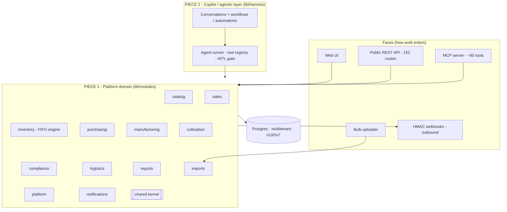

# Architecture overview

This project is deliberately **two pieces**, and they are separated in the code, not just in the story:

1. **The platform** - a rewritten Distru: a modular, multitenant ERP domain that stands on its own and is built to grow (and, if ever needed, to split into services). It has *no idea the AI exists*.
2. **The Copilot** - an agentic harness layered **on top of** the platform, plus the answer to the take-home. It depends on the platform; the platform never depends back.

## The organizing idea: one domain, many faces

A single **org-scoped domain layer** is the source of truth, and every way work enters is a thin adapter over it: the web UI, the public REST API (**152 documented routes**, drift-guarded on every build), the MCP server (**~80 tools** covering the whole domain, derived from the Copilot's own tools), the bulk `/upload-products` uploader, outbound **HMAC-signed webhooks**, and the Copilot. There is exactly one place that knows how to create a product, so chat, the API, and imports never disagree. Adding a capability is one module function plus thin wrappers. The API is also browsable in-app through an interactive **API Reference explorer** at `/api-reference`.

## The two pieces, in code

- **Piece 1 - the platform** lives in `lib/modules/*` as twelve bounded-context modules (`catalog`, `inventory`, `sales`, `purchasing`, `manufacturing`, `compliance`, `cultivation`, `logistics`, `reports`, `platform`, `imports`, `notifications`) over a `shared` kernel. Each module exposes a public barrel and hides its internals. This is a **modular monolith** with an enforced dependency direction - see [Modular architecture](/docs/modular-architecture).
- **Piece 2 - the Copilot** lives in `lib/harness/*`: a streaming runner, a tool registry, a human-in-the-loop gate, conversation persistence, and automations. It calls the platform's public barrels and is the take-home answer - see [The take-home](/docs/take-home) and [The agentic harness](/docs/harness).

The boundary is real and machine-checked: an ESLint rule forbids any `lib/modules/**` file from importing `@/lib/harness/*`. The AI sits on top of the domain; the domain can be understood, tested, and shipped without it.

## Stack, and why

- **Next.js 16 (App Router), React 19, TypeScript**, one deploy target (Vercel). The agent loop, the REST API, the MCP server, and the UI live in one codebase with one auth story.
- **Postgres via Drizzle** on the `postgres.js` driver, portable from local to Neon.
- **better-auth** with the organization plugin for real multitenancy; **UUIDv7** for auth and domain rows alike, so they share one keyspace.
- **Anthropic `claude-opus-5`** by default (streaming, adaptive thinking) - but behind a `ModelProvider` seam, so the model vendor is swappable (`MODEL_PROVIDER=openai`) without touching the harness. See [The agentic harness](/docs/harness).

Three decisions carry the design:
- **Domain over the database, not over HTTP.** The Copilot's tools call module functions directly, with no internal HTTP hop, so the agent is fast and transactional; REST and MCP call the *same* functions.
- **A manual streaming agent loop**, not the SDK tool-runner, because human-in-the-loop needs to pause a turn mid-stream, persist, and resume across a stateless serverless invocation.
- **Multitenancy at the boundary.** Every module function takes an org-scoped context, so a caller physically cannot read another org's rows.

Read on - **Piece 1:** [Modular architecture](/docs/modular-architecture), [Data model](/docs/data-model). **Piece 2:** [The take-home](/docs/take-home), [The agentic harness](/docs/harness), [The import pipeline](/docs/import-pipeline), [Decisions, scope and building](/docs/building).
