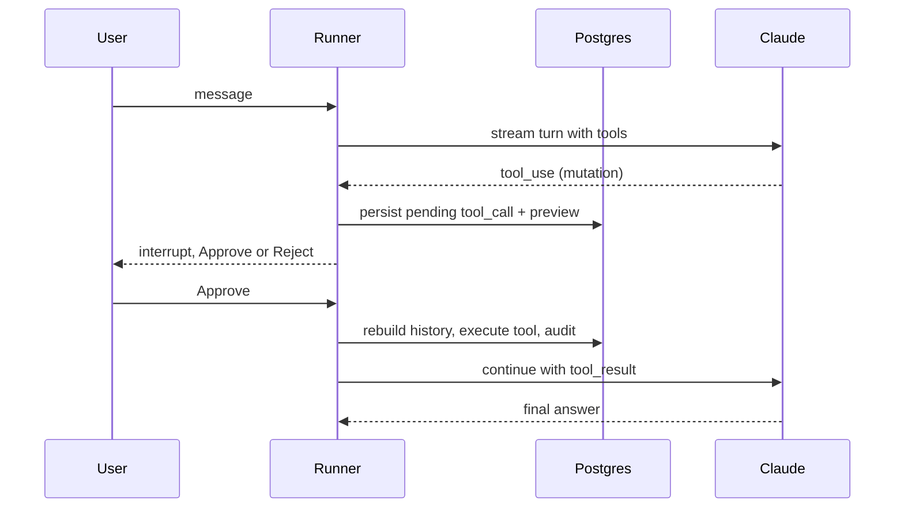

# The agentic harness

Piece 2, the Copilot. It lives in `lib/harness/` and sits **on top of** the platform modules - it calls their public barrels and is never called back. A capability is a self-describing tool; the runner is a manual streaming loop that can pause for a human and resume from the database. Nothing lives in server memory between turns.

## The tool contract

```ts
type HarnessTool<I> = {
  name: string;
  description: string;
  inputSchema: z.ZodType<I>;   // becomes JSON Schema for the model
  gate: "none" | "confirmation" | "question";
  buildPreview?(input, ctx): HarnessToolPreview;   // the approve / ask card
  execute(input, ctx, extra?): Promise<ToolResult>;
};
```

The **gate** is the entire safety model, and it is a property of the tool, not the loop:
- `none` - read-only, auto-executes.
- `confirmation` - a mutation; pauses for approve / reject with a rendered preview.
- `question` - the first-class `ask_user` path; pauses for a structured answer.

JSON Schema for the model is derived from the same Zod schema that validates input, so a tool cannot describe itself one way and accept another. Tools register in a registry, and **adding a capability is adding a tool** - nothing in the loop changes. The registry now holds **~80 tools across every domain** - catalog, inventory (incl. transfers and scan), sales, purchasing, manufacturing (incl. scheduling), cultivation, grow/COA, compliance, logistics/deliveries, CRM, tasks, analytics, reports, imports, integrations, docs, and workflows - and the loop is exactly the code below regardless. Every tool runs against an org-scoped `AgentContext`, so multitenancy is enforced here at the tool boundary.

## The runner loop

```ts
async function runLoop(ctx, messages, autoApprove = false) {
  const provider = getModelProvider();                // anthropic | openai | ...
  for (step of 0..MAX_STEPS) {                         // capped at 16
    const turn = await provider.streamTurn(            // emits tokens/thinking
      { system, messages, tools: toolSpecs() }, ctx.emit);
    await appendMessage("assistant", turn.content);    // persist canonical blocks
    if (turn.stopReason !== "tool_use") return emit({ type: "done" });

    const results = [], interrupts = [];
    for (tu of turn.toolUses) {
      const tool = getTool(tu.name);
      if (tool.gate === "none") {                     // read - run now
        const res = await tool.execute(tu.input, ctx);
        record(tu, { status: "auto", output: res });
        results.push(toolResult(tu.id, res));
      } else if (autoApprove) {                       // workflow / system trigger
        const res = await tool.execute(tu.input, ctx, { answer: NO_HUMAN });
        record(tu, { status: "auto", requiresConfirmation: true, output: res });
        results.push(toolResult(tu.id, res));
      } else {                                        // human present - gate it
        const preview = await tool.buildPreview(tu.input, ctx);
        record(tu, { status: "pending", preview });
        interrupts.push({ toolUseId: tu.id, name: tu.name, preview });
      }
    }
    if (interrupts.length) return emit({ type: "interrupt", interrupts }); // PAUSE
    await appendMessage("user", results);             // feed back, loop
  }
}
```

## Model-agnostic: the provider seam

The loop above never names a vendor. Every model-specific detail lives behind a **`ModelProvider`** interface (`lib/harness/providers/`), so swapping Claude for GPT (or any OpenAI-compatible endpoint) is one env var - `MODEL_PROVIDER=openai` - and changes nothing in the loop, the tools, the gates, or the conversation store.

```ts
interface ModelProvider {
  id: string;                    // "anthropic" | "openai" | ...
  model: string;
  isConfigured(): boolean;
  streamTurn(req: { system, messages, tools }, emit): Promise<{
    content;      // assistant message in CANONICAL block form
    stopReason;   // "tool_use" | "end_turn" | ...
    toolUses;     // parsed { id, name, input }[]
  }>;
}
```

Two decisions make this clean:

- **A canonical IR.** The harness standardizes on Anthropic's content-block message shape (`text` / `tool_use` / `tool_result` / `thinking`) as its internal representation - it's a superset, and it's what we persist. A provider whose wire format differs (OpenAI chat messages, say) translates at **its own edge**, so nothing downstream sees the difference. The bundled `openai` provider does exactly this over the Chat Completions streaming API, with no extra dependency.
- **Tools defined once.** `toolSpecs()` emits provider-neutral `{ name, description, inputSchema }` from the same Zod schemas; each provider maps them into its own tool format. So the same registry that powers the Copilot, the MCP, and now every model vendor stays the single source of truth.

Adding a vendor is one file implementing `ModelProvider` plus one line in the provider registry. The customer's own connected MCP servers (QuickBooks, Metrc, Drive) plug in on the *other* side - as tools in the registry (see [One capability, two faces](/docs/two-faces)) - so "our harness, their models, their integrations" is all the same set of seams.

## Human-in-the-loop, serverless-safe

Mutating tools and `ask_user` never auto-run. The mechanism:

- **Trigger:** the runner sees a gated tool call, builds a preview, writes a `pending` `tool_calls` row, emits `interrupt`, and closes the stream. No partial `tool_result` is sent, so the assistant turn stays open exactly as the API requires.
- **Who can act:** any member of the conversation's org; the decision and actor are recorded on the row.
- **Resume:** the client posts decisions to `/api/conversations/[id]/resume`. The server rebuilds history from Postgres and, for every tool call in the last turn, produces a `tool_result`: reuse stored output, execute approved mutations now, "User declined" for rejects, pass the answer through for `ask_user`. It appends one combined message and re-enters the loop.

The pause can be answered minutes later by a different person on a different invocation, so state lives entirely in Postgres. The SDK tool-runner does not expose this seam, which is the whole reason the loop is hand-written.



## Trigger-agnostic, and tools beyond our own

`runConversationTurn(ctx, { autoApprove: true })` runs an Automation: gated tools execute immediately instead of pausing, attributed to `workflow:<id>`. The runner has no idea whether a human or a cron fired it. And because a tool is just `{ name, description, inputSchema, gate, execute }`, tools discovered from a customer's connected MCP servers (QuickBooks, Metrc, Drive) register alongside the built-ins and inherit the same gate, preview, and audit wrapper.

The same shape pays off in the other direction too: because a tool is self-describing, the **same registry is re-exposed as our own MCP server** for external agents to drive - one definition, both faces, no drift. See [One capability, two faces](/docs/two-faces).
