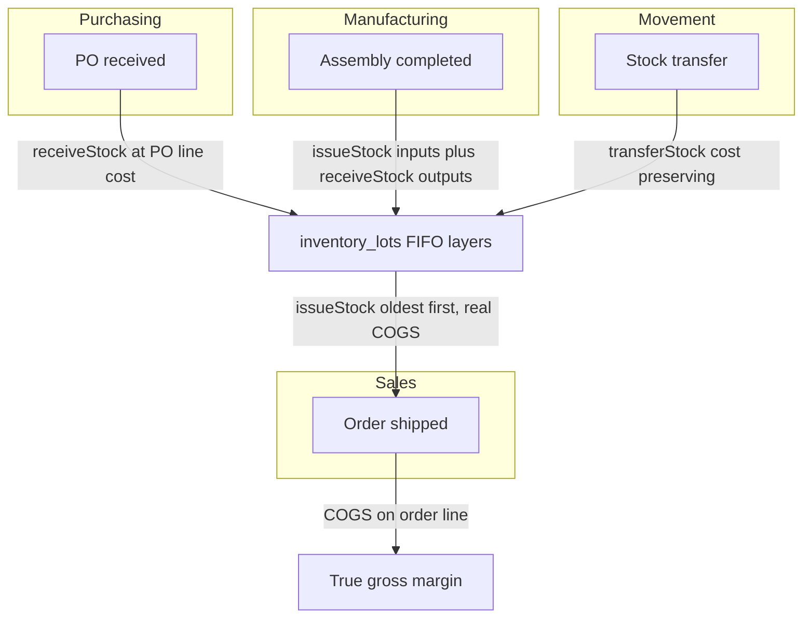

# The inventory engine

On-hand was always honest here - it's `SUM(inventory_ledger.quantityDelta)`, an append-only ledger, never a mutable counter. What was missing was **cost**. Stock that moves without a cost is stock you can count but can't value: no COGS on a sale, no margin on an order, no dollar figure on the shelf. This engine adds the cost dimension without giving up the audit trail, and then wires the three modules that move the most stock - purchasing, sales, manufacturing - to ride it.

## The model: an append-only ledger over FIFO cost layers

Two tables, one idea. The **ledger** (`inventory_ledger`) is unchanged in spirit - every movement is a row, on-hand is the sum of deltas - but each row now also carries `unitCost`, a `lotId`, a `binId`, and a `refType`/`refId` pair that traces the movement back to the document that caused it (an order, a purchase, an assembly, a transfer). The new table is **`inventory_lots`**: a FIFO cost layer. A receipt opens a lot at a known unit cost with a `remainingQty`; issues draw that quantity down **oldest-first** (`receivedAt asc`). So valuation is `SUM(remainingQty * unitCost)` over open lots, and an issue inherits the real per-unit cost of the specific layers it consumed.

Why layers rather than a single moving-average cost on the product? Because FIFO is what a cannabis ERP's auditors, accountants, and Metrc all expect, and because a cost layer *remembers where it came from* - a lot can point at the Metrc-tagged package it represents and the source document that created it, so a dollar of inventory value is traceable to a receipt. Products also gained a standard `unitCost` as the fallback basis when a movement has no better cost to quote (opening balances, pre-lot stock).

| Table | Role | Key columns |
|---|---|---|
| `inventory_ledger` | append-only movements; on-hand = `SUM(quantityDelta)` | `quantityDelta`, `unitCost`, `lotId`, `binId`, `refType`/`refId`, `reason`, `actor` |
| `inventory_lots` | FIFO cost layer, drawn down oldest-first | `unitCost`, `originalQty`, `remainingQty`, `receivedAt`, `sourceType`/`sourceId`, `packageId` |

## Three primitives, one choke point

The engine lives in `lib/modules/inventory/costing.ts` and is deliberately small - three verbs and a valuation query:

- **`receiveStock`** opens a lot at a given unit cost (falling back to the product's standard cost) and posts one matching positive ledger movement. Returns the new lot and on-hand.
- **`issueStock`** selects open lots `FOR UPDATE`, draws them down oldest-first, posts one negative movement per layer at that layer's cost, and returns **real COGS** plus the per-lot allocation. It **throws `InsufficientStockError` unless `allowNegative`** - see below.
- **`transferStock`** composes the two: FIFO-issue from the source, then re-receive each drawn allocation into the destination *at the same per-lot unit cost*, so cost travels with the goods.

The decision that made all of this cheap: **`adjustInventory` - the one function every existing caller already used - now delegates to these primitives.** A positive delta opens a layer, a negative delta issues FIFO. Because every module posted stock through that single function, every module got lot costing the day the delegation landed, with no change to its own code. That is the whole payoff of having had one choke point in the first place.

```ts
// lib/modules/inventory/inventory.ts - the delegation that costed everything at once
if (input.delta > 0) {
  await receiveStock(ctx, { ...at standard cost, sourceType: "ADJUSTMENT" });
} else if (input.delta < 0) {
  await issueStock(ctx, { ...allowNegative: true }); // corrections may go negative
}
```

### Block-on-shortfall is the default, and that's correct

`issueStock` refuses to take more than is on-hand. This is not a limitation - it is the ERP-correct behavior: you cannot ship what you do not have, and a sale that silently drives stock negative is a data-integrity bug wearing a feature's clothes. So the **typed business paths - shipping an order, consuming an assembly input, moving a transfer line - block**, surfacing an `InsufficientStockError` the caller turns into an honest 422. The one path that *may* go negative is `adjustInventory`, because a cycle-count correction legitimately says "the shelf has fewer than the system thinks" - it passes `allowNegative` and posts an uncosted movement at standard cost for the shortfall.

## How the big three ride the engine

The point of the primitives is that the real modules use them, so a cannabis flow is **costed end to end** - from the purchase order that brought material in, through the assembly that transformed it, across a transfer between rooms, to the sale that shipped it with a true gross margin.



**Purchasing.** Receiving a PO opens a lot per line at the **line's actual cost** - what you really paid, not a guess - so the value that enters inventory is the value on the bill.

**Sales.** Shipping FIFO-issues each line (blocking on shortfall) and writes the real per-line **COGS onto `order_items.cogs`**. An order therefore carries a true gross margin - revenue minus the actual cost of the specific lots that left the building - not a modeled one. Canceling a shipped order re-opens a layer at the COGS that was removed, so valuation stays consistent through the reversal.

**Manufacturing.** Completing an assembly is now a **real transaction**, not a status flip. It consumes each input FIFO (yielding input COGS), rolls that together with the applied labor/overhead/packaging costs into a **per-unit output cost**, and produces the outputs as costed lots - stamping the rolled cost onto `assembly_outputs.unitCost`. It is **idempotent**, guarded by `assemblies.inventoryPosted`, and pre-flights every input against on-hand so a shortfall blocks the whole run before anything is consumed. Worked example, verified live against the running DB: inputs of 10 units at \$5 and 20 units at \$2, plus \$50 of applied labor, over 5 output units, roll to exactly **\$28.00/unit** (`(50 + 40 + 50) / 5`).

A planned run also carries a **scheduled window** (`scheduledStart`/`scheduledEnd` + an operator label), and moving it to IN_PROGRESS opens **reservations** - soft holds (`assembly_reservations`) that keep two planned runs from both counting on the same units, so the planning UI shows `available = on-hand − reserved`. Completing the run releases the holds and consumes the real stock; canceling releases them untouched.

## Multi-location transfers, with an audit record

Moving stock between rooms or facilities is its own resource. `stock_transfers` + `stock_transfer_lines` are the durable, readable record; `lib/modules/inventory/transfers.ts` `createTransfer` posts each line through `transferStock` - cost-preserving and blocking - then persists the header and lines (each with its `movedCost`) as the audit trail an operator or auditor reads back. Because a transfer is just issue-then-receive at the same cost, no value is created or destroyed by moving goods; only their location changes.

The package actions ride the same primitives: `/packages/move` transfers the package's quantity between locations (cost-preserving) and repoints the package; `/packages/finish` issues the package's quantity out of inventory and marks it `FINISHED`, Metrc's terminal package state.

## Serial, barcode, and scan

`packages` gained `barcode`, `serialNumber`, `metrcTag`, `labTestingState`, and `batchId`; products gained `barcode`. On top of those, **`scanCode(ctx, code)`** resolves a scanned string - barcode, package tag, Metrc tag, serial, or product SKU/barcode - to the package or product it identifies, so pointing a scanner at a label returns the thing and its on-hand. This is genuine scan-lookup and lot-level identity; it is honestly *not* yet per-serial-unit inventory tracking (a serial is a field on the package, not its own stock position).

## Compliance ties: licenses and COAs

Two links close the compliance loop around the costed inventory:

- **License validation.** `licenses` gained a `companyId`, so a license can belong to a customer or vendor (or to the org itself when null). `validateCompanyLicense` answers *"does this company hold a currently-valid license?"* - powering a selling-to-unlicensed flag - and `expiringLicenses(days)` drives expiry alerts. `/companies/{id}/licenses` now returns the company's **own** licenses rather than the org's.
- **COA to package.** `test_results` gained a `packageId`, so a certificate of analysis links to the specific lot-level package it was run on; `getPackageTestResult` fetches the COA tied to a package.

## What this is and isn't

It is a real transactional inventory engine: auditable movements, FIFO cost layers, true COGS and valuation, block-on-shortfall, transactional manufacturing (with production scheduling and input reservations layered on top), cost-preserving multi-location transfers, scan identity, and compliance validation. It is honestly **not** the last mile of a shipping ERP - a package label PDF exists (basic), and external Metrc/accounting sync runs mocked in the demo behind a config-aware seam that switches to live adapters on real credentials. Those boundaries are named precisely in [Distru fidelity](/docs/fidelity). What changed is that "affect inventory for real" now means *with cost*, everywhere, on the same append-only ledger it always used.
