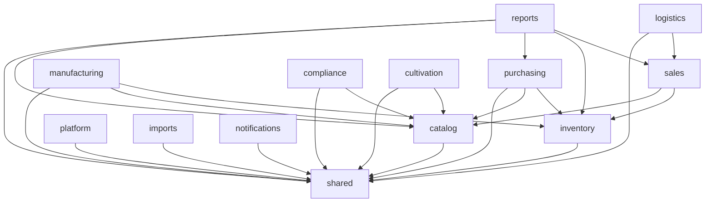

# Modular architecture

Piece 1 - the platform - is a **modular monolith**: a single deployable, organized into bounded-context modules with a strict, *machine-enforced* dependency direction. It runs as one process today and can be pulled apart into services later without rewriting the domain, because the seams already exist.

## The modules

Every module lives under `lib/modules/<context>/` and exposes a **public barrel** (`index.ts`); callers import the barrel, never the files inside.

```text
lib/modules/
  shared/        kernel: ServiceCtx (tenancy) · serializers · audit trail
  catalog/       products + reference data (categories, subcategories, companies, company notes, contacts, groups, strains, tags, taxes, locations, unit types)
  inventory/     append-only on-hand ledger, FIFO cost layers (lots), stock adjustments, bins, packages (Metrc trace fields), batches, multi-location transfers, scan lookup, valuation/COGS
  sales/         orders, order charges, invoices, payments, returns, credits, analytics, price tiers, terms, charge presets, menus
  purchasing/    purchase orders (buying from vendors; receiving posts FIFO lots)
  manufacturing/ assemblies (nested inputs/outputs, transactional completion), production scheduling, input reservations, cost types + costs
  compliance/    licenses (company-linked, validity/expiry), license types, test results / COAs (package-linked, structured potency), Metrc linkage
  cultivation/   plant batches, plants, harvests, plant events (seed-to-sale grow lifecycle)
  logistics/     drivers, vehicles, delivery routes, deliveries (dispatch lifecycle that drives order fulfillment)
  reports/       Insights report registry + durable artifacts (cross-domain reads)
  platform/      API tokens, webhooks, audit, custom fields, attachments, tasks, integration connections + sync events
  imports/       import files / jobs / rows (persistence)
  notifications/ the notification feed behind the bell
```

Every Distru resource lives in one of these contexts - see [The complete Distru domain](/docs/distru-domain) for the full resource map and how deep each is wired.

Each context also **owns its tables** in `db/schema/*` - `catalog.ts`, `inventory.ts`, `sales.ts`, `purchasing.ts`, `manufacturing.ts`, `compliance.ts`, `cultivation.ts`, `logistics.ts`, `reports.ts`, `platform.ts` (+ `integrations.ts`), `imports.ts`, `notifications.ts` - **74 tables** in all, so a module's data and logic sit together. That table ownership is exactly what a future service would take with it.

## The dependency graph (acyclic, layered)



Dependencies only point **downward**: composite modules (`sales`, `manufacturing`, `reports`, `logistics`) depend on leaf modules (`inventory`, `catalog`, `sales`); every module depends on `shared`; nothing depends upward, and there are **no cycles**. The Copilot layer depends on modules; **no module depends on the Copilot**.

## The boundaries are enforced, not just documented

The dependency direction is a build-time rule, so the architecture can't quietly rot as the codebase grows. `eslint.config.mjs`:

```js
// Import a module's public barrel, never its internals.
{ files: ["**/*.ts"], rules: { "@typescript-eslint/no-restricted-imports":
  ["error", { patterns: [{ group: ["@/lib/modules/*/*"],
    message: "Import @/lib/modules/<module>, not its internals." }] }] } }

// Piece 1 (domain) must not import Piece 2 (the Copilot) or the UI.
{ files: ["lib/modules/**/*.ts"], rules: { "@typescript-eslint/no-restricted-imports":
  ["error", { patterns: [
    { group: ["@/lib/harness", "@/lib/harness/*"], message: "The AI layer depends on the domain, never the reverse." },
    { group: ["@/app/*"], message: "Domain modules must not import the UI/faces." }] }] } }

// The shared kernel depends on nothing else in the domain.
{ files: ["lib/modules/shared/**/*.ts"], rules: { /* forbid ../catalog, ../sales, ... */ } }
```

Try to import the harness from a domain module and `npm run lint` fails with *"The AI layer depends on the domain, never the reverse."* The boundary bites.

## Adding a module (the platform grows here)

Every context in the platform was added by the same recipe - `sales` makes the clearest worked example. Adding orders + invoicing (and later purchase orders, returns, assemblies, and stock transfers, which post inventory in the opposite direction) meant

1. a schema file (`db/schema/sales.ts`) the module owns;
2. a module (`lib/modules/sales/`) with an `index.ts` barrel, depending downward on `inventory` + `catalog`;
3. thin wrappers on each face - a REST route, an import target, a UI page, and Copilot tools (the MCP surface comes free: it is [derived from the Copilot tools](/docs/two-faces), not written per-module) -

and **nothing above the module changed**. `manufacturing`, `compliance`, `cultivation`, `logistics`, and `reports` all landed the same way: own their tables, depend downward, expose a barrel, wrap them on the faces.

## The path to microservices

Because each module is a bounded context that owns its tables, communicates through a public API, and never forms a cycle, extracting one is mechanical:

| Seam today | Extraction step |
|---|---|
| Public barrel (`@/lib/modules/sales`) | Becomes the service's RPC/HTTP client - callers don't change shape |
| Cross-module call (`sales → inventory.adjust`) | Becomes a network call or an emitted domain event |
| Module-owned tables (`sales.ts`) | Move with the service into its own database |
| `ServiceCtx` (org + actor) | Already the request envelope a service would receive |
| `audit_log` + webhooks | Already the cross-cutting event surface |

The point of the modular monolith is to **defer** that cost until scale demands it, while keeping the option open. Today one deploy is simpler, faster (in-process calls, real transactions), and cheaper to operate - and the boundaries are already drawn.
